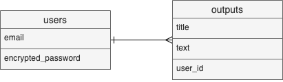

# Play and Learn in the Program

# アプリケーション概要
このWebアプリケーションはポートフォリオサイトになります。
開発者のポートフォリオの掲載とプログラム学習のアウトプットの投稿を行っています。

# アプリケーションのURL
https://play-and-learn-in-the-program.herokuapp.com/

# 利用方法
当サイトは開発者のポートフォリオの掲載とプログラム学習のアウトプットの投稿をするサイトになっています。
ポートフォリオとアウトプットは一覧表示されており、各画像またはタイトルをクリックするとそれぞれのページに遷移して内容の閲覧ができます。

# 目指した課題解決
一つ目として、開発者自身のプログラム学習効果の向上を目的としたアウトプットを行い、それをアクセスして頂いたユーザー(プログラミング初学者)に参考にして頂くことです。
二つ目として、学習の成果としてのポートフォリオを掲載し、それに触れてもらうことで閲覧したユーザーにプログラムに興味を持ってもらうことです。

# 要件定義
## ユーザー管理機能
ユーザーアカウントの登録、ログイン・ログアウトの実装をしました。
基本的に開発者のみが使用する機能になります。アウトプットの投稿・編集・削除を行う際にログイン状態でのみ、それらの操作を行えるよう条件分岐で実装を行いました。

## アウトプット投稿機能
開発者のプログラム学習のアウトプットを投稿する機能です。
投稿の他、編集・削除も行えるよう実装しました。各種操作に関しては、前項に記載した通りログイン状態のみでしか行うことができません。
投稿したアウトプットは未ログインユーザーでも閲覧ができるようになっています。

## ポートフォリオ掲載
開発者が作成したアプリケーションなどを掲載しています。
アプリケーションのタイトルとそのスクリーンショットを掲載しており、それらをクリックするとそのアプリケーションに遷移するようになっています。

# DEMO
## トップページ
ヘッダー右側にポートフォリオとアウトプットのプルダウンがあり、アウトプットに関しては最新の投稿5件が表示されるようになっています。
ポートフォリオとアウトプットのタイトルをクリックするとそれぞれのページへと遷移します。
また、ヘッダーのすぐ下のカルーセルにはポートフォリオをスクリーンショットとともに載せており、タイトルまたは説明文をクリックすると各アプリケーションへと遷移します。

トップページをスクロールすると、簡単な自己紹介文とポートフォリオ及びアウトプットのそれぞれの一覧があります。

## ポートフォリオ
ポートフォリオ一覧の画像またはタイトルをクリックするとそのアプリケーションのページに遷移します。
ヘッダーのプルダウンまたはカルーセルからも遷移できるようになっています。

## アウトプット
トップページ下部の「アウトプット一覧ページへ」をクリックするとこれまで投稿した全てのアウトプットの一覧ページに遷移します。
アウトプットのタイトルをクリックすると、そのアウトプットの本文を閲覧できます。トップページのアウトプットのタイトルまたはヘッダーのプルダウンからもアウトプットの個別ページまたは一覧ページに遷移することができます。

# 工夫したポイント
- アプリケーション開発において共通する流れを手順書としてまとめておいて、それを上から順番に実行するだけでいいようにしました。
- 開発のスピードを上げるためにBootstrap(Webフレームワーク)のテンプレートを使用して、デザインにかける時間の短縮をしています。
- 早期にエラーを発見できるように、コーディング中の確認を多めに取りました。多い時には一文コーディングしたら確認するといったことも行っていました。
- 自分がまだやったことのない実装に関しては、別途ミニアプリを作成して実装可能か確認を行いました。アウトプットの投稿でマークダウン記法を適用するために「redcarpet」というGemを使用する際に初めにミニアプリで実装して動作確認を行っています。

# 使用技術（開発環境）

## バックエンド
Ruby, Ruby on Rails

## フロントエンド
HTML, CSS, JavaScript

## データベース
MySQL

## 本番環境
Heroku

## ソース管理
GitHub, GitHub Desktop

## テスト
RSpec

## エディタ
Visual Studio Code

# 今後実装予定の機能
- アウトプットの曖昧検索  
投稿件数が増えてきた際に、曖昧検索で投稿を探せるようにするために実装したいです。
- アウトプットのタグ付け  
例えば言語ごとにタグをつけるなどして、ソートできるようにするなどの実装を行いたいです。

# テーブル設計

## usersテーブル

| Column             | Type   | Options                   |
| ------------------ | ------ | ------------------------- |
| email              | string | null: false, unique: true |
| encrypted_password | string | null: false               |

### Association
- has_many :outputs

## outputsテーブル

| Column | Type       | Options                        |
| ------ | ---------- | ------------------------------ |
| title  | string     | null: false                    |
| text   | text       | null: false                    |
| user   | references | null: false, foreign_key: true |

### Association
- belongs_to :user

## ER図
